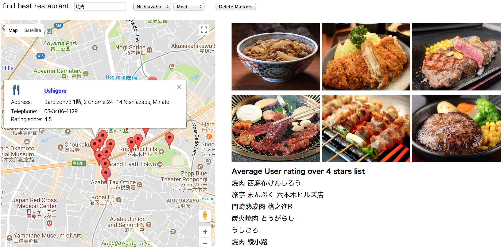

# [FindTokyoRestaurant](https://takeyan1004.github.io/FindTokyoRestaurant/grf1218final.html)

## About

The main purpose of this web service is to find out great restaurants in Tokyo even if they don't know the name of the foods.
When foreign tourists come to Tokyo, there are tons of great options, but it is very difficult to choose one place. One of the main reasons is that we don't remember the name of the foods.

The unique point of this web service is that we can choose one type of food out of the category pictures. You don't need to remember the name of the food you want to try and search google or google map with the word. All you need here is to choose area and the food picture you want to try. Then, the website reccommends you the great options based on the area and the picture you chose.

## Version
There are a few versions for the website. Please refer to the below file(the latest version) 

grf1218final.html

## Preview

[]

**[View Live Preview](https://takeyan1004.github.io/FindTokyoRestaurant/grf1218final.html)**

## PROGRAMMING LANGUAGES & TOOLS

HTML, CSS, Javascript, Google Map API